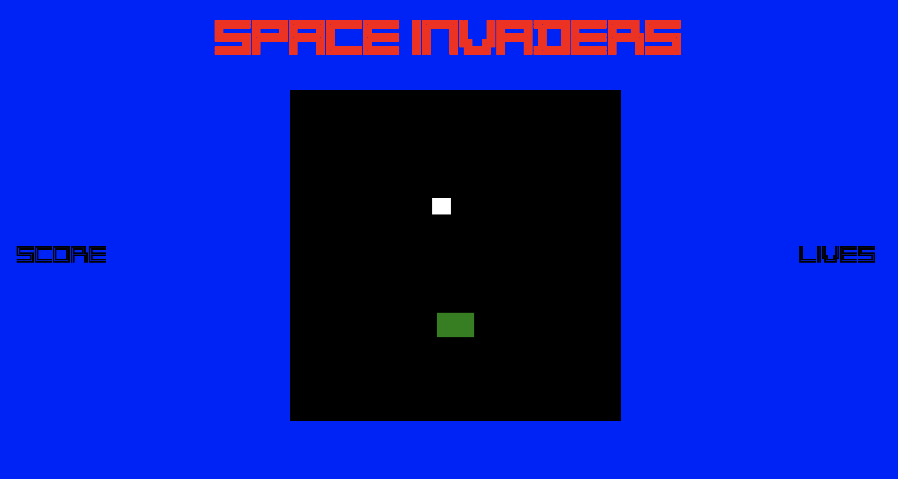

# SpaceInvaders
Collaborative project build by Team 1 at Code Nation week 8 challenge.

This repo contains the code for the code nation space invaders build challenge for Team 1.

## The Brief

- Create a space invaders game.
- Time limit: 18 hours

# Our Plan
 
 After our intial consulation and reaserch we decide to build the game as follows:

[See our intial concept work here](docs/concept.md)

- Create a space invaders web browser game utilising CSS, HTML, JavaScript and the [canvas](https://developer.mozilla.org/en-US/docs/Glossary/Canvas) method discovered through our intial research.
- Organise team to cover all needed tasks using toggle, trello and github.
- Created an immediate kanban board to work on our minimum viable product (MVP) version of our game and broke down the MVP elements to create.
- Decide on gameplay elements including speed of ships, number of players, control methods, difficulty ramping; determine which will be included in the MVP initial release and which are for future development.
- Research canvas further for development of the game.
- Decide on an overall design/layout of our page.
- Get project signed off before commencing by code nation instructor

## Future ideas for integration / later versions

- Increase number of players
- Create number of lives
- Ailens will fire back
- 3 barriers at start, one shot will destroy each barrier
- Once player reaches set number of levels game is completed
- Life increments by one for each completed level
- Different background for each level
- Increment score by different amounts for different aliens
- Additional aliens with different characteristics introduced at higher levels
- 3 barriers breaking apart bit by bit
- Aliens start at different positions on each level
- Increasing number of aliens at start of each level
- Aliens speed increases as level progresses Periodic bonus aliens at top of game board with same point reward for each
- Periodic bonus aliens at top of game board with cumulative points rewarded for each
- Aliens rate of fire increases as number of aliens get lower
- Aliens fire starts at higher level for each level completed
- Kinect / accelerometer on phone / use mouse on desktop to control
- Cubic 3D version

## Summary so far:

- The game is now at a stage of player moving and bullet firing from player.
- Aliens move left to right across screen and moves down when reaches the edge.
- Landing page and CSS complete with a prompt box to start the game and a window prompt on game over.

- Things to continue development on:

- We are looking at creating a class to create more instances of bullets on the canvas. So that both ailen and player can shoot multiple bullets.
- Working on the code so that when player bullet meets ailen we have a collision and the ailen is stoped from being drawn.
- Create an array so we can "draw" more instances of ailens.

## The team was made up of

- [@StuartCowley](https://github.com/StuartCowley)
- [@ryan-farrell](https://github.com/ryan-farrell)
- [@EllieJudge](https://github.com/EllieJudge)
- [@Yrazi](https://github.com/Yrazi)